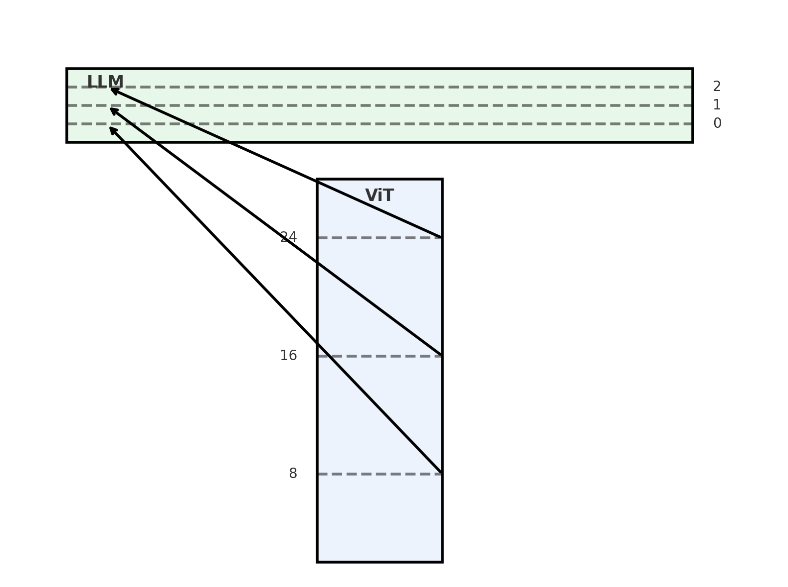
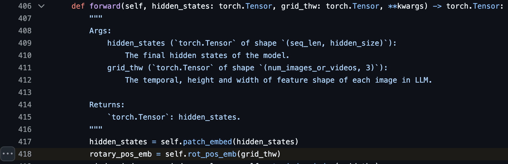
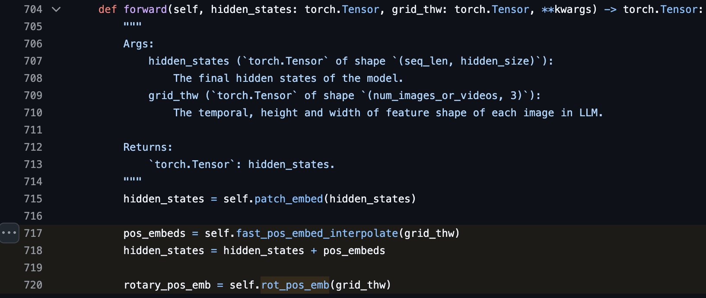
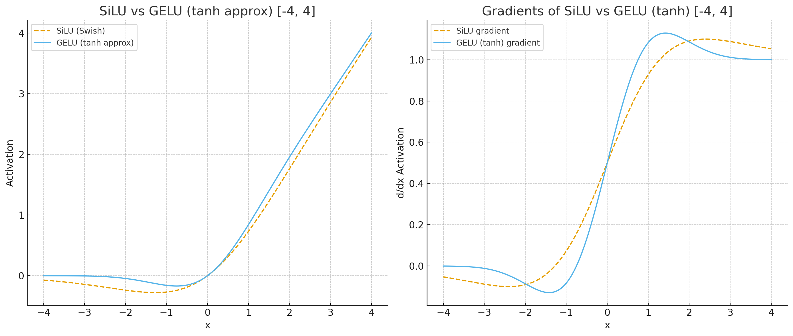
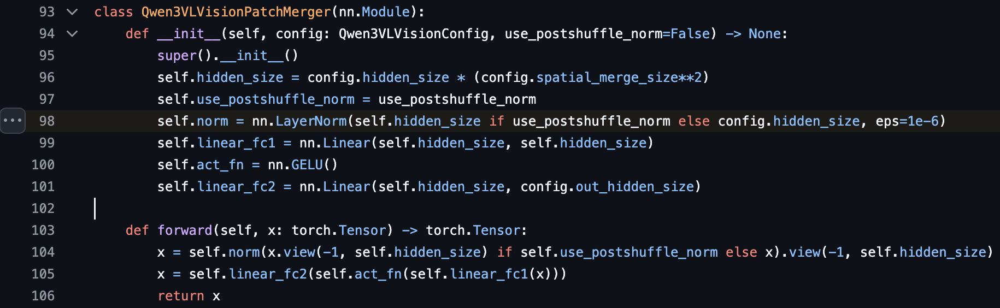
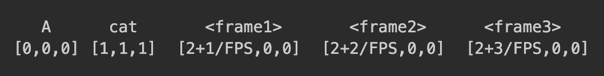
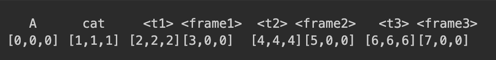

The Qwen-VL series has consistently been the most performant VLM in the open-source community. After a year of waiting, the [PR](https://github.com/huggingface/transformers/pull/40795) for Qwen3-VL has finally arrived 🎉 

There will be two models: a dense variant and a MoE variant. Given how well MoE is performing and that Qwen3 has a MoE variant, this is unsurprising. Based on the PR, we can see the following changes from Qwen2.5-VL.

## Deepstack -- Vision Feature Aggregation
This is the largest algorithmic change. Instead of using ViT's final output for LLM input, they extract visual representations from several layers. The visual features are extracted from 3 layers by default [(8, 16, 24)](https://github.com/huggingface/transformers/blob/088e9c30712151060aacecd3454150f4edd83cd1/src/transformers/models/qwen3_vl/configuration_qwen3_vl.py#L42). 

These features are then added to the LLM's hidden state in the first few layers. They call this [Deepstack](https://github.com/huggingface/transformers/blob/088e9c30712151060aacecd3454150f4edd83cd1/src/transformers/models/qwen3_vl/modeling_qwen3_vl.py#L862-L868). This intuitively creates a long residual connection to the ViT and helps improve visual representation learning.

[](https://github.com/huggingface/transformers/blob/088e9c30712151060aacecd3454150f4edd83cd1/src/transformers/models/qwen3_vl/modeling_qwen3_vl.py#L862-L868)

## ViT 
Based on the code, it appears that Qwen3-VL still pretrains its own ViT instead of using off-the-shelf models like SigLip. The biggest change in the ViT is the position embedding!

### Position Embedding
In the previous Qwen2.5-VL, the position embedding for each vision patch is relative, implemented with [RoPE](https://github.com/huggingface/transformers/blob/088e9c30712151060aacecd3454150f4edd83cd1/src/transformers/models/qwen2_vl/modeling_qwen2_vl.py#L717-L719). 

For Qwen3-VL, the position embedding for vision patches is a combination of absolute learnable embedding (similar to how DINO works) + relative position embedding. [The absolute learnable embedding is added to the hidden state and then RoPE is applied](https://github.com/huggingface/transformers/blob/088e9c30712151060aacecd3454150f4edd83cd1/src/transformers/models/qwen3_vl/modeling_qwen3_vl.py#L717-L720). By having these learnable absolute position embeddings, the grounding capability of the VLM improves. Previously, the same technique was used in [Keye-VL 1.5](https://arxiv.org/pdf/2509.01563).

<table>
  <thead>
    <tr>
      <th style="text-align:left; width: 50%;">Qwen2.5-VL</th>
      <th style="text-align:left; width: 50%;">Qwen3-VL</th>
    </tr>
  </thead>
  <tbody>
    <tr>
      <td>
        <b>Relative</b> position embedding (RoPE) for vision patches
      </td>
      <td>
        <b>Absolute learnable</b> position embedding <b>+</b> RoPE
      </td>
    </tr>
    <tr>
      <td>
        <a href="https://github.com/huggingface/transformers/blob/088e9c30712151060aacecd3454150f4edd83cd1/src/transformers/models/qwen2_vl/modeling_qwen2_vl.py#L717-L719">
          
        </a>
      </td>
      <td>
        <a href="https://github.com/huggingface/transformers/blob/088e9c30712151060aacecd3454150f4edd83cd1/src/transformers/models/qwen3_vl/modeling_qwen3_vl.py#L717-L720">
          
        </a>
      </td>
    </tr>
  </tbody>
</table>

### Activation
Qwen3-VL switches from `silu` to `gelu_pytorch_tanh`. The comparison is shown below. `GeLU` has much steeper gradients near 0.

<table>
  <thead>
    <tr>
      <th style="text-align:left; width: 50%;">Qwen2.5-VL</th>
      <th style="text-align:left; width: 50%;">Qwen3-VL</th>
    </tr>
  </thead>
  <tr>
    <td style="vertical-align: top; width: 50%;">
      <b>SiLU</b><br>
      <code>
        SiLU(x) = x · σ(x)
      </code>
    </td>
    <td style="vertical-align: top; width: 50%;">
      <b>GELU<sub>tanh</sub></b><br>
      <code>
        GELU<sub>tanh</sub>(x) = 0.5 · x · (1 + tanh(√(2/π) · (x + 0.044715 x³)))
      </code>
    </td>
  </tr>
  <tr>
    <td>Fewer FLOPs</td>
    <td>More FLOPs</td>
  </tr>
  <tr>
    <td>Smoother gradients near 0, taper off slower.</td>
    <td>Sharper gradients near 0, taper off faster.</td>
  </tr>
  <tr>
    <td colspan="2" style="text-align:center;">
      
    </td>
  </tr>
</table>

### Patch Merging Normalization
One interesting design in the new ViT is that it has [post-pixelshuffle normalization](https://github.com/huggingface/transformers/blob/088e9c30712151060aacecd3454150f4edd83cd1/src/transformers/models/qwen3_vl/modeling_qwen3_vl.py#L98) after patch merging. An additional layer norm is applied after the pixel shuffle operation. Apparently, different vision patches can have very distinct distributions, and this operation is needed to make the output smoother.
<a href="https://github.com/huggingface/transformers/blob/088e9c30712151060aacecd3454150f4edd83cd1/src/transformers/models/qwen3_vl/modeling_qwen3_vl.py#L98">
  
</a>

## Video Position Embedding
Qwen2.5-VL introduced [MRoPE](https://github.com/huggingface/transformers/blob/088e9c30712151060aacecd3454150f4edd83cd1/src/transformers/models/qwen2_5_vl/modeling_qwen2_5_vl.py#L957-L1140), which is a 3D RoPE that encodes the temporal dimension in the first index (modulated by the FPS), and the width/height in the remaining two indices.

In Qwen3-VL, this has changed to [explicit text based timestamp](https://github.com/huggingface/transformers/blob/088e9c30712151060aacecd3454150f4edd83cd1/src/transformers/models/qwen3_vl/modeling_qwen3_vl.py#L917-L1034) tokens before the video frames, i.e., `<t1> <vision_start> <frame1> <vision_end> <t2> <vision_start> <frame2> <vision_end> ...`. This provides absolute temporal information compared to the previous version. 

If the input is `A cat <frame1> <frame2> <frame3>` where each frame has one vision patch, the comparison is as follows:
<table>
  <tr>
    <th style="text-align:center;">Qwen2.5-VL</th>
    <th style="text-align:center;">Qwen3-VL</th>
  </tr>
  <tr>
    <td style="vertical-align: top; width: 50%;">
      <a href="https://github.com/huggingface/transformers/blob/088e9c30712151060aacecd3454150f4edd83cd1/src/transformers/models/qwen2_5_vl/modeling_qwen2_5_vl.py#L957-L1140">
        
      </a>
    </td>
    <td style="vertical-align: top; width: 50%;">
      <a href="https://github.com/huggingface/transformers/blob/088e9c30712151060aacecd3454150f4edd83cd1/src/transformers/models/qwen3_vl/modeling_qwen3_vl.py#L917-L1034">
        
      </a>
    </td>
  </tr>
</table>
Such a design will improve the temporal localization capability of VLM.

<!-- ```
   A      cat       <frame1>       <frame2>      <frame3>
[0,0,0] [1,1,1]  [2+1/FPS,0,0]  [2+2/FPS,0,0]  [2+3/FPS,0,0]
``` -->
<!-- ```
   A      cat    <t1> <frame1>   <t2> <frame2>   <t3> <frame3>
[0,0,0] [1,1,1] [2,2,2][3,0,0]  [4,4,4][5,0,0]  [6,6,6][7,0,0]
``` -->